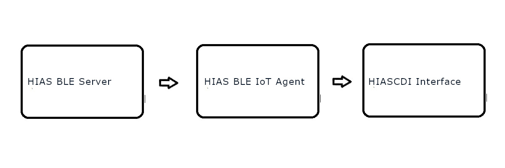

# Documentation

&nbsp;

# Introduction

PIR sensors can play a large role in Internet of Things (IoT) security systems. This project shows the potential of using an ESP32 to host a Bluetooth Low Energy (BLE) server providing readings from an PIR sensor to a HIAS BLE IoT Agent.

The server waits for a HIAS BLE IoT Agent to connect and provides it with the current reading of the PIR sensor. The BLE IoT Agent next verifies the server has permissions to store data on the HIAS network via the HIASBCH iotJumpWay permissions smart contract.

Once the server is verified, the BLE IoT Agent processes the sensor data, updates the related contextual data and stores the data in the historical database.

&nbsp;

# Hardware

 - [ESP32 Devkit](https://docs.espressif.com/projects/esp-idf/en/latest/esp32s2/hw-reference/esp32s2/user-guide-saola-1-v1.2.html)
 - [HC-SR501 PIR Sensor](https://www.amazon.es/Yizhet-HC-SR501-Infrared-Arduino-Raspberry/dp/B08B3L19QF)
 - Wires

&nbsp;

# Software

 - [Arduino IDE](https://www.arduino.cc/en/software)
 - [Arduino-ESP32](https://github.com/espressif/arduino-esp32)

&nbsp;

# Getting Started

To set up and install your HIAS ESP32 PIR Sensor follow the following guides:

- [Installation guide](installation/installation.md)

&nbsp;

# Contributing
Asociación de Investigacion en Inteligencia Artificial Para la Leucemia Peter Moss encourages and welcomes code contributions, bug fixes and enhancements from the Github community.

Please read the [CONTRIBUTING](https://github.com/AIIAL/HIAS-ESP32-PIR-Sensor/blob/main/CONTRIBUTING.md "CONTRIBUTING") document for a full guide to contributing to our research project. You will also find our code of conduct in the [Code of Conduct](https://github.com/AIIAL/HIAS-ESP32-PIR-Sensor/blob/main/CODE-OF-CONDUCT.md) document.

## Contributors
- [Adam Milton-Barker](https://www.leukemiaairesearch.com/association/volunteers/adam-milton-barker "Adam Milton-Barker") - [Asociación de Investigacion en Inteligencia Artificial Para la Leucemia Peter Moss](https://www.leukemiaresearchassociation.ai "Asociación de Investigacion en Inteligencia Artificial Para la Leucemia Peter Moss") President/Founder & Lead Developer, Sabadell, Spain

&nbsp;

# Versioning
We use [SemVer](https://semver.org/) for versioning.

&nbsp;

# License
This project is licensed under the **MIT License** - see the [LICENSE](https://github.com/AIIAL/HIAS-ESP32-PIR-Sensor/blob/main/LICENSE "LICENSE") file for details.

&nbsp;

# Bugs/Issues
We use the [repo issues](https://github.com/AIIAL/HIAS-ESP32-PIR-Sensor/issues "repo issues") to track bugs and general requests related to using this project. See [CONTRIBUTING](https://github.com/AIIAL/HIAS-ESP32-PIR-Sensor/blob/main/CONTRIBUTING.md "CONTRIBUTING") for more info on how to submit bugs, feature requests and proposals.