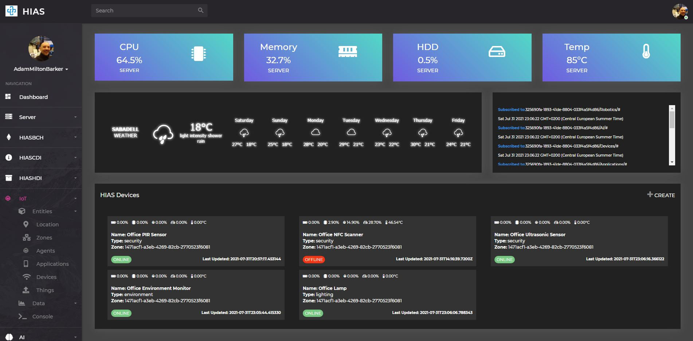
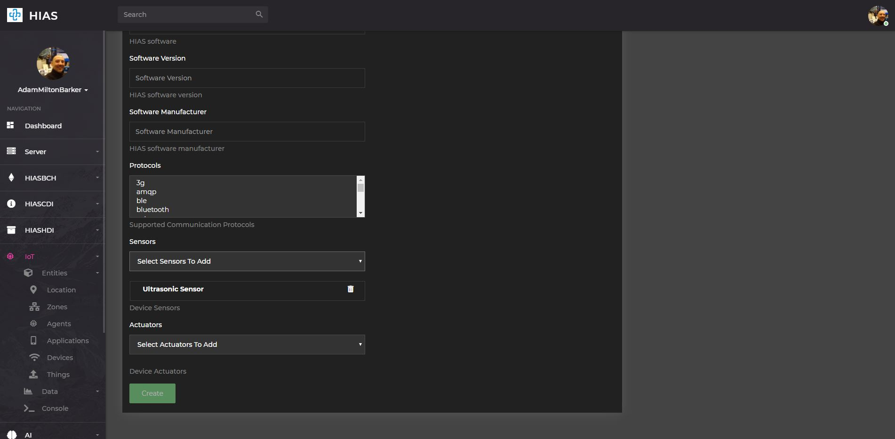
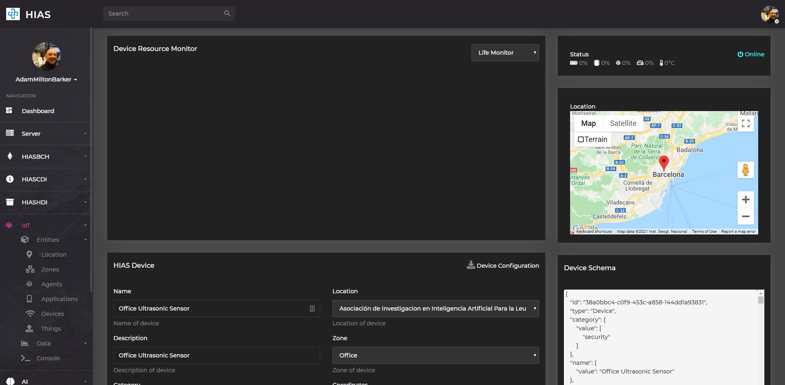
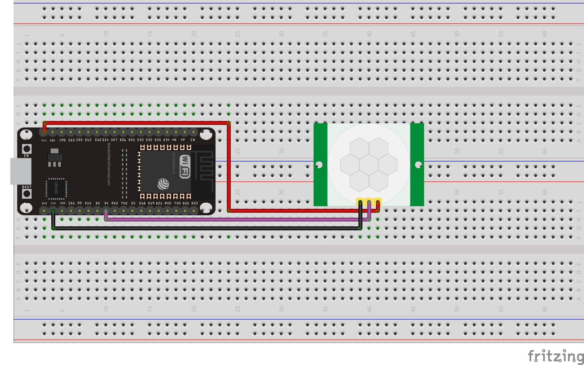
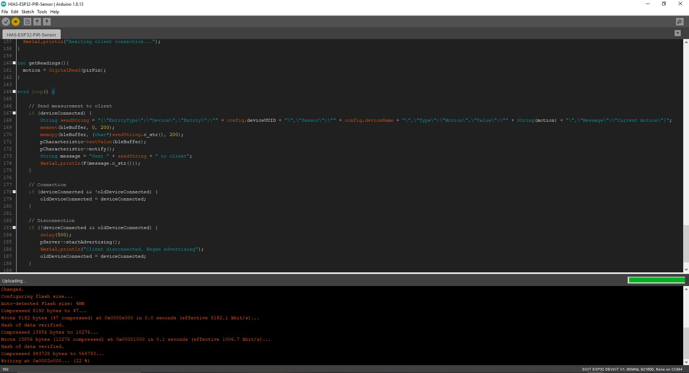
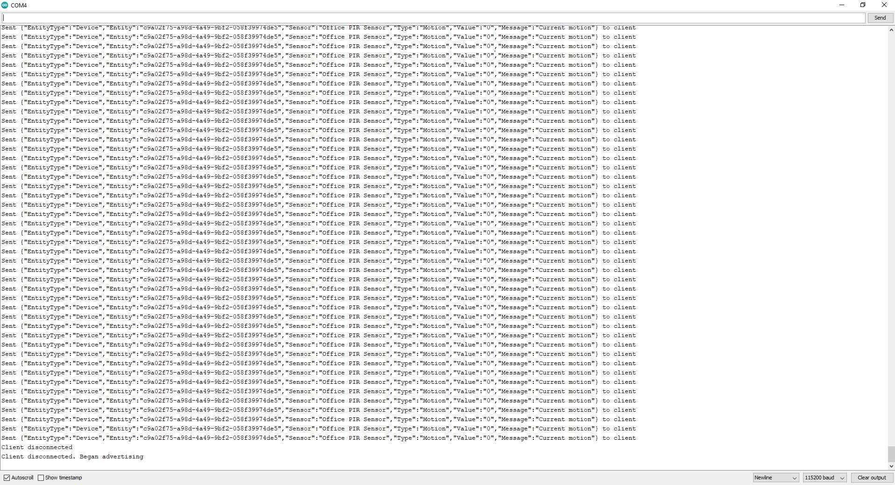

# Installation Guide


# Introduction
This guide will take you through the installation process for the **HIAS ESP32 PIR Sensor** project.

&nbsp;

# Prerequisites
You will need to ensure you have the following prerequisites installed and set up.

## Arduino

 - [Arduino IDE](https://www.arduino.cc/en/software)
 - [Arduino-ESP32](https://github.com/espressif/arduino-esp32)

## HIAS
 - [HIAS Core](https://github.com/AIIAL/HIAS-Core)
 - [HIASCDI](https://github.com/AIIAL/HIASCDI)
 - [HIASHDI](https://github.com/AIIAL/HIASHDI)
 - [HIASBCH](https://github.com/AIIAL/HIASBCH)
 - [HIAS MQTT IoT Agent](https://github.com/AIIAL/HIAS-MQTT-IoT-Agent)
 - [HIAS MQTT Blockchain Agent](https://github.com/AIIAL/HIASBCH-MQTT-Blockchain-Agent)
 - [HIAS BLE IoT Agent](https://github.com/AIIAL/HIAS-BLE-IoT-Agent)

&nbsp;

# Operating System
The HIAS ESP32 PIR Sensor installation guide is compatible with:

- Windows
- Ubuntu

&nbsp;

# Clone the repository

Clone the [HIAS ESP32 PIR Sensor](https://github.com/AIIAL/HIAS-ESP32-PIR-Sensor " HIAS ESP32 PIR Sensor") repository from the [Peter Moss MedTech Research Project](https://github.com/AIIAL "Peter Moss MedTech Research Project") Github Organization.

To clone the repository and install the project, make sure you have Git installed. Now navigate to the directory you would like to clone the project to and then use the following command.

``` bash
 git clone https://github.com/AIIAL/HIAS-ESP32-PIR-Sensor.git
```

This will clone the HIAS ESP32 PIR Sensor repository.

``` bash
 ls
```

Using the ls command in your home directory should show you the following.

``` bash
 HIAS-ESP32-PIR-Sensor
```

Navigate to the **HIAS-ESP32-PIR-Sensor** directory, this is your project root directory for this tutorial.

## Developer forks

Developers from the Github community that would like to contribute to the development of this project should first create a fork, and clone that repository. For detailed information please view the [CONTRIBUTING](https://github.com/AIIAL/HIAS-ESP32-PIR-Sensor/blob/main/CONTRIBUTING.md "CONTRIBUTING") guide. You should pull the latest code from the development branch.

``` bash
 git clone -b "2.0.0" https://github.com/AIIAL/HIAS-ESP32-PIR-Sensor.git
```

The **-b "2.0.0"** parameter ensures you get the code from the latest developer branch. Before using the below command please check our latest main branch in the button at the top of the project README.

&nbsp;

# HIAS

## HIAS Device



This project is a HIAS iotJumpWay (network) device. To set up a HIAS network device visit your [HIAS Core](https://github.com/AIIAL/HIAS-Core) UI and navigate to **IoT -> Devices**, then click on the **+ CREATE** button at the top right of the device list.



Complete the form with the information about your HIAS ESP32 PIR Sensor.

### Remember

- Make sure to select **PIR Sensor** as a device sensor.
- Make sure to save the configuration provided once the device is created.

## HIAS Device Configuration



Once your HIAS device has been created, you will be able to access it via **IoT -> Devices**. At the top of the configuration pane you will see the **Device Configuration** download button. Download the configurationfile to the **arduino/HIAS-ESP32-PIR-Sensor/data** directory and save it as **config.json**.

&nbsp;

# ESP32

Now you need to wire up your ultrasonic sensor to your ESP32.



&nbsp;

# Arduino

For this tutorial you need need **Arduino IDE 1.8.13**. You cannot use the **Arduino IDE 2.0 BETA** as it currently does not provide the **ESP32 Sketch Data Upload** feature.



Navigate to the **arduino/HIAS-PIR-Sensor** directory in your project root and double click the **HIAS-PIR-Sensor.ino** file to open it in Arduino IDE.

Make sure you select the **DOIT ESP32 DEVKIT V1** board in **Tools** and select the correct **COM port** in the port settings.

To upload the **config.json** file we downloaded from HIAS to the ESP32, click on **Tools -> ESP32 Sketch Data Upload**. This will upload the config file that will be used by the server during startup.



Finally, click on the **Upload** button in Arduino IDE and wait for the software to upload to your ESP32. Once the upload process has finished, open the **Serial Monitor**.

If you already have the HIAS BLE IoT Agent running you will need to restart it so that it retrieves the updated BLE device list. Once you have restarted the HIAS BLE IoT Agent, you will be able to see the data that is being sent to the agent in the serial monitor.

&nbsp;

# Contributing
Asociación de Investigacion en Inteligencia Artificial Para la Leucemia Peter Moss encourages and welcomes code contributions, bug fixes and enhancements from the Github community.

Please read the [CONTRIBUTING](https://github.com/AIIAL/HIAS-ESP32-PIR-Sensor/blob/main/CONTRIBUTING.md "CONTRIBUTING") document for a full guide to contributing to our research project. You will also find our code of conduct in the [Code of Conduct](https://github.com/AIIAL/HIAS-ESP32-PIR-Sensor/blob/main/CODE-OF-CONDUCT.md) document.

## Contributors
- [Adam Milton-Barker](https://www.leukemiaairesearch.com/association/volunteers/adam-milton-barker "Adam Milton-Barker") - [Asociación de Investigacion en Inteligencia Artificial Para la Leucemia Peter Moss](https://www.leukemiaresearchassociation.ai "Asociación de Investigacion en Inteligencia Artificial Para la Leucemia Peter Moss") President/Founder & Lead Developer, Sabadell, Spain

&nbsp;

# Versioning
We use [SemVer](https://semver.org/) for versioning.

&nbsp;

# License
This project is licensed under the **MIT License** - see the [LICENSE](https://github.com/AIIAL/HIAS-ESP32-PIR-Sensor/blob/main/LICENSE "LICENSE") file for details.

&nbsp;

# Bugs/Issues
We use the [repo issues](https://github.com/AIIAL/HIAS-ESP32-PIR-Sensor/issues "repo issues") to track bugs and general requests related to using this project. See [CONTRIBUTING](https://github.com/AIIAL/HIAS-ESP32-PIR-Sensor/blob/main/CONTRIBUTING.md "CONTRIBUTING") for more info on how to submit bugs, feature requests and proposals.